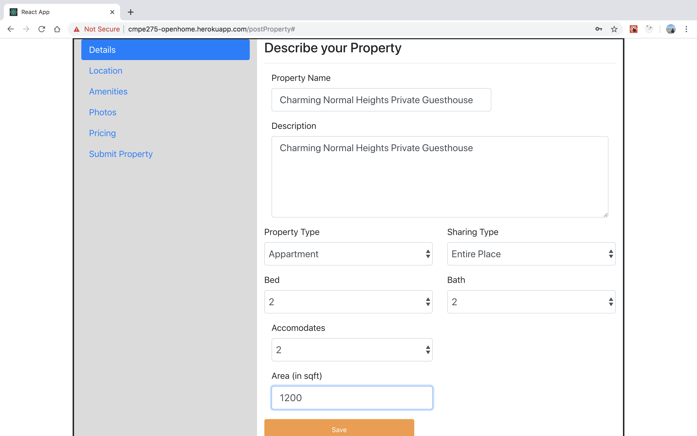
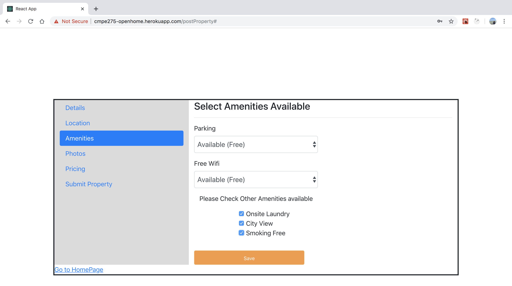

<link rel="stylesheet" href="readme-src/readme.css">

# OpenHome

> CMPE275 -Sec 01: Enterprise Application Development course team project
> Fall 2019

## Goal

* The goal of this project is to build an application that allows two types of user to login to the system. One is "Host" who can post their property to be booked by "Guest". Other is "Guest", who can search for property and can book for his/her required date.

## Introduction

* User can be Host and Guest
* Host can signup only by email id in domain : "sjsu.edu"
	* After signup host will get a verification link
	* After clicking on the verification link, host will be verified
	* After verification, host will be able to post property
* Post Property supports following features:
	* Property Details
		- Property Name
		- Property Description:
    - Property Type
			- Drop down list
    - Sharing Type
      - Drop down list
	* Property location
    	- Property Address
	* Amenities
    	- Wifi/parking
	* Photos
      - Any image file can be uploaded
	* Property Availability dates and price
      - Availability start date
      - Availability end date
      - Availability days
      - Weekend price
      - Weekday price
* Edit property supports following features:
    * Edit Property
      - Edit Property Availability start date
      - Edit Property Availability end date
      - Edit Property weekday price
      - Edit Property weekend price
    * Delete Property
      - Deletes Property and cancels any booking for that property
* Host dashboard
    * Property wise
      - Property booking details on basis of selected property
    * Month wise
      - Property booking details on basis of selected month

* Guest can signup with any email id
    * After signup guest will get a verification link
    * After clicking on the verification link, guest will be verified
      - After verification, guest will be able to search or book any property
    * Property Search feature includes:
      - Property search includes following mandatory fields:
      	- Location
      	- Start Date
        - End Date
      - Property search includes following optional fields:
        - Sharing type
          - Private room
          - Entire place
        - Property Type
          - Apartment
          - Condo
          - Villa
          - TownHouse
        - Wifi Availability
          - Maximum and Minimum price
    * Property Results page (Paginated):
        - All properties as per the guest search query
    * Property Detail page:
        - Selected property by user
    * Booking Page
        - Card Registration
          - Validity of credit card no
          - Validity of CVV
          - Validity of billing address
        - Card Selection
        - Confirm Booking
    * Booking confirmation page:
        - Summary of property booked by guest
    * Guest dashboard
        - All bookings (Paginated)
          - Property booking details
        - Month wise
          - Property booking details on basis of selected month
    * My trip
        - All bookings that are yet to checked in or checked out by user (Paginated)
          - Guest can click corresponding button for checkin/checkout
          - Guest can click cancel button for cancel booking

* Time management
    * Time advancement
      - Guest/Host can advance time to future and can check in/checkout/cancel booking

## High Level Architecture

## Technology stack

 
<table>
<thead>
<tr>
<th>Area</th>
<th>Technology</th>
</tr>
</thead>
<tbody>
	<tr>
		<td>Front-End</td>
		<td>React, React Router, Bootstrap, HTML5, CSS3, Javascript ( ES6 )</td>
	</tr>
	<tr>
		<td>Back-End</td>
		<td>Spring Boot (Hibernate, JPA, AOP), Java </td>
	</tr>
	<tr>
		<td>API Testing</td>
		<td>Postman</td>
	</tr>
	<tr>
		<td>Database</td>
		<td>MySQL (AWS RDS)</td>
	</tr>
	<tr>
		<td>Image File Storage</td>
		<td>AWS S3 Bucket</td>
	</tr>
    <tr>
		<td>Deployment</td>
		<td>AWS EC2 , Heroku</td>
	</tr>
</tbody>
</table>
 

## Database

> Database design and the data was critical for the project so To maintain consistency within team we deployed our database on AWS RDS (MySQL).

## Screenshots

#### Login/Signup

#### User Account Verification Email

#### User Account Verification Success Email

#### User Login

#### Post Property

#### Edit Property

#### Host Dashboard

#### Guest Property Search

#### Guest Property Booking

#### Guest Trip Details

#### Guest Dashboard

#### Steps to run the application
  -  Access URL : "https://cmpe275-openhome.herokuapp.com/login"
  -  Signup
  -  Verify through the link sent to your email id.
  -  Login with verified email id.
  -  In the header, click on "Host", through dropdown select "Post Property".
  -  Property Post includes multiple pages.
  -  Enter details on each page and click on "Save".
  -  Navigate to different pages through left navbar.
  -  On last page, click on "Submit property" to post the property.
  -  In the header, click on "Host", through dropdown select "Logout".
  -  Login as guest.
  -  Search for property to book
  -  Book property through normal flow
  -  In the header click on "Guest", through dropdown select "My trips" to checkin/checkout/cancel.
  -  In the header click on "Guest", through dropdown select "Guest Dashboard" to view guest's dashboard.
  -  Click on month dropdown on dashboard page, to view monthly summary.
  -  In the header, click on "Time advancement" button to change the date and time.

## Team Members

*	Chintala Dheeraj Dharma
*	Manish Katturu  
*	Sayali Patil
*	Surabhi Sinha
